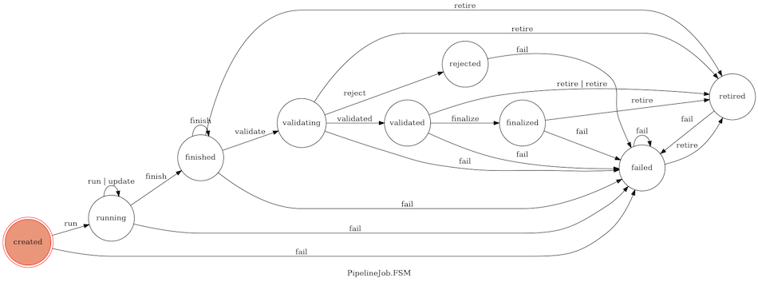

============
PipelineJobs
============

Once we have represented a distinct *pipelines* of software parts and parameterizations, we still need to tie metadata about experimental design and inputs to specific invocations (jobs) of those pipelines and their outputs. That is handled by the PipelineJobs system, which works in tandem with Pipelines and the other parts of the Data Catalog.

PipelineJobs has two components. The first is a persisent Reactor that collects and manages state information for each and every ``PipelineJob``. It is addressable by web callback or direct message. The other is a client-side library
bundled with the ``sd2e/reactors:python`` base image, which we leverage from within the coordinating Reactor in a pipeline to initiate tracking of a PipelineJob.

What is a PipelineJob?
**********************

Essentially, it's an entry in the ``jobs`` collection of the Data Catalog with a specifc structure and a specific usage pattern enforced and enabled by the Pipeline Jobs Manager Reactor and logic in the client-side Python ``datacatalog`` package.

A PipelineJob has five key properties:

* ``pipeline_uuid`` - unique ID referring to a known, active pipeline
* ``uuid`` - unique ID hashed from the originating actorId and parameterization
* ``status`` - current state of the job
* ``history`` - ordered, timestamped history of the jobs state

Transitions among states of a PipelineJob are implemeted using a Finite State Machine. The current set of states and valid transition events is illustrated here:

Create a Pipeline
*****************

Before you can leverage the Pipelines extension, you have to tell the Data Catalog
about the pipeline you will be running. You must do this once for each unique set
of components and fixed options. The process for registering a pipeline is
described in detail elsewhere. For the time being let's assume you have done it
already and that your Pipeline **UUID** is ``f0f417f2-ba8b-5ac4-b421-255b69553391``

Create a PipelineJob
********************

It is assumed you have experience developing and deploying using TACC's Abaco functions-as-a-service platform and that you are using the **Reactors** client-side SDK embedded in the ``sd2e/reactors:python2`` or ``sd2e/reactors:python3`` base images.

Extend the Reactor configuration file
^^^^^^^^^^^^^^^^^^^^^^^^^^^^^^^^^^^^^

Add a ``pipelines`` block in the file ``config.yml`` as follows:

.. code-block:: yaml

   pipelines:
     pipeline_uuid: f0f417f2-ba8b-5ac4-b421-255b69553391
     updates_nonce: ~
     authn: ~
     pipeline_manager_id: G1p783PxpalBB
     job_manager_id: G56vjoAVzGkkq

**Explanation**: Pipeline UUID is the unique identifier for your pipeline. The empty keys values for ``update_nonce`` and ``authn`` configure your Reactor to look for these values in the `secrets.json` file. The two "id" fields are Abaco ``actor.id`` for Reactors managed by TA4 team which implement the Pipelines system.

Add deployment secrets
^^^^^^^^^^^^^^^^^^^^^^

Add the following keys to file `secrets.json`. Please note that the values shown below are mockups. You will need to consult a manager to get the actual values.

.. code-block:: json

   {
       "_REACTOR_PIPELINES_AUTHN": "bW9uZ29kYjovL2NlgqbVdolMjUlMjaW5nLnNkMmUub3JnOjI3MDFDJTNGTk5wQGNob21ibMjRWJTI2SCUyQiy1zdGFnIwL2FkbWluP3JlYWRQcmVmZXJlbmNlPXByaW1hcnk=",
       "_REACTOR_PIPELINES_UPDATES_NONCE": "SD2E_XqsfKLFd3nrN"
   }

**Explanation**: These values override ``pipelines.authn`` and ``pipelines.updates_nonce`` from ``config.yml`` when the Reactor is deployed, but without committing those values to the source code or adding them to a public Docker image.

Add PipelineJob code to reactor.py
^^^^^^^^^^^^^^^^^^^^^^^^^^^^^^^^^^

**Outline**

* Create a stub `PipelineJob`
* Use its  `path` property to set the archivePath for present and future Reactors and Apps in the pipeline
* Initialize the job `new_job.setup()`
* Set the job to active with `new_job.run()`
* Finish your reactor's specific processing and setup tasks
* Launch the additional tasks (making sure they are configured to use the callbacks system to update the job)

Set up a stub PipelineJob
~~~~~~~~~~~~~~~~~~~~~~~~~

Import the PipelineJob class and initialize an instance of it.

.. code-block:: python

   from datacatalog.pipelinejobs import PipelineJob

   rx = Reactor()
   # Note: Each must be the exact string value enumerated in the Data Catalog
   #       Eventually, we will add strict validation.
   my_job = PipelineJob(rx, 'UW_BIOFAB', 'Yeast-Gates', 'sample.uw_biofab.133737/A2')

**Explanation**: The `my_job` object now represents a job in the Data Catalog. It has five key properties.

* ``uuid`` - The unique ID for your new job
* ``data`` - Any "extra" parameterization info you passed (defaults to your Reactor's message)
* ``callback`` - a template for Agave job notifications
* ``token`` - a value that must be included in messages sent to the Pipeline Jobs Manager
* ``path`` - Absolute path on the ``data-sd2e-community`` Agave storage system where outputs should be sent

One task that nearly all Pipelines do is set up some Agave app jobs that archive their outputs to a defined location (their ``archivePath``). The Pipelines data model assumes that a job's ``path`` is where its outputs will reside.

Note the values for ``uuid`` and ``token``. In this section of the documentation, it is assumed that we are working with a PipelineJob entirely within the context of a single execution of a Reactor. Some pipelines are built around multiple invocations of a manager Reactor. in which case these values are needed to manage the PipelineJob in  those subsequent executions. You can use Reactor's own ``state`` function to store and retrieve these values in those future executions.

.. code-block:: pycon

   # Example
   print(my_job.path)
   >>> '/products/v1/beb14196-a09c-5c93-b0af-0234a8d14123/0e704c02-c1ab-5c4d-8fb9-a68399e9396d/7157e2f6-e231-5fc6-9f50-0519e183dd37/3b98ff33-d982-5cdc-9f02-5a70471e9629/solid-snake-20180913T162843Z'

*Explanation**: This may seem like an unwieldy path, but keep in mind it isn't designed to be person-readable, but rather to prevent critical results from being over-written. It also helps facilitate retrieval of pipeline jobs outputs by programmatically.

Instantiate the PipelineJob
~~~~~~~~~~~~~~~~~~~~~~~~~~~

The ``setup`` method creates a new entry in the Data Catalog jobs table and sets
its status to *CREATED*.

.. code-block:: pycon

   my_job.setup()
   print(my_job.status)
   >>> 'CREATED'

Start the PipelineJob running
~~~~~~~~~~~~~~~~~~~~~~~~~~~~~

When you are reasonably certain that the pipeline job is working as intended, go ahead and call the ``run`` method. Note that you can pass an arbitrary Python ``dict`` to be stored alonside the ``RUN`` event in the job history.

.. code-block:: pycon

   my_job.run()
   # Pass dict as argument
   my_job.run({'key1': 'value1'})
   # Pass dict as named parameter "data"
   my_job.run(data={'key1': 'value1'})

   print(my_job.status)
   >>> 'RUNNING'

Update the PipelineJob
~~~~~~~~~~~~~~~~~~~~~~

PipelinesJobs accept ``update`` events once they are in a ``RUNNING`` state. This will append an ``UPDATE`` entry to  the job's history. Here's an example, and an illustration of the consequence in the Data Catalog.

.. code-block:: pycon

   my_job.update({'roadrunner': 'meep-meep!'})

If we look at the job's database entry, we see its ``history`` slot looks like:

.. code-block:: json

   {"history" : [
       {
           "CREATE" : {
               "date" : "2018-09-18T01:50:15.284",
               "data" : null
           }
       },{
           "RUN" : {
               "date" : "2018-09-18T01:50:15.459",
               "data" : null
           }
       },{
           "UPDATE" : {
               "date" : "2018-09-18T01:50:15.573+0000",
               "data" : {
                   "roadrunner" : "meep-meep!"
               }
           }
      }]}

Chaining operations
~~~~~~~~~~~~~~~~~~~

You can string  management operations together. This is handy, for example, to
do setup and run in a single line of Python. Here's an example:

.. code-block:: pycon

   my_job.setup({'key1': 'value1'}).run().update('{key2': 'value2'})
   print(my_job.status)
   >>> 'RUNNING'

Cancel a PipelineJob
~~~~~~~~~~~~~~~~~~~~

You may cancel an instantiated PipelineJob. This will delete the job entry from the Data Catalog entirely. This may only be done if the job **has not** entered a ``RUNNING`` status.

.. code-block:: pycon

   my_job.cancel()

Failing a PipelineJob
~~~~~~~~~~~~~~~~~~~~~

A job that has begun running can be terminated by sending it a ``fail`` event. A utility method is provided to assist in this.

.. code-block:: pycon

   my_job.fail()
   print(my_job.status)
   >>> 'FAILED'

Deferred Updates to PipelineJobs
^^^^^^^^^^^^^^^^^^^^^^^^^^^^^^^^

Overview
~~~~~~~~

The Pipelines system leverages Agave's event-driven notification and Abaco's rich callback support to let Agave jobs update the status of the PipelineJob created by the Reactor that spawned them. It is equally possible for other Reactors (or even future executions of the current Reactor) to update PipelineJobs as well. Rather than relying on persisent database connnections, this is accomplished this by a event system implemented in the ``pipeline-jobs-manager`` Reactor `(documented here) <https://gitlab.sd2e.org/sd2program/pipeline-jobs-manager>`_.

Update from an Agave Job
~~~~~~~~~~~~~~~~~~~~~~~~

Let's assume we have a Reactor `fcs-reactor` that coordinates execution of an Agave job using the app `fcs-etl-0.4.0u16`. The Reactor already has code to generate a job definition from a template and can generate a JSON job definition that resembles this example.

.. code-block:: json

   {
     "name": "FCS ETL processing job",
     "inputs": {"inputData": "agave://data-sd2e-community/transcriptic/yeast-gates_q0/r1bbq4mr76ngd/3/instrument_output"},
     "archiveSystem": "data-sd2e-community",
     "archivePath": "/transcriptic/yeast-gates_q0/r1bbq4mr76ngd/3/processed/fcs-etl-0.4.0u2/20180710-1430-proven-pig",
     "appId": "fcs-etl-0.4.0u2",
     "batchQueue": "normal",
     "maxRunTime": "12:00:00",
     "archive": true,
     "notifications": [
       {
         "url": "notifications@sd2e.org",
         "event": "FINISHED",
         "persistent": false
       },{
         "url": "notifications@sd2e.org",
         "event": "FAILED",
         "persistent": false
       }]}

We can enable this job to update a PipelineJob with one addition to ``notifications``:

.. code-block:: json

   {
      "url": "https://api.sd2e.org/actors/v2/G56vjoAVzGkkq/messages?x-nonce=SD2E_XqsfKLFd3nrN&token=940a5adc78720505&uuid=58fa9ec7-6c25-5525-94f3-e853335e2f17&status=${STATUS}",
      "event": "*",
      "persistent": false
   }

**Explanation:** Actor ``G56vjoAVzGkkq`` is the ``pipeline-jobs-manager``. The url parameters encode event and authorization details: The ``x-nonce`` parameter lets the job send a message to ``G56vjoAVzGkkq``, ``token`` is a job-specific password with a duration of 72 hours, ``uuid`` is the job's unique identifier, and ``status`` is the Agave API job status. We set ``event`` to ``*`` which means that all events from the job are sent to ``pipeline-jobs-manager``, and we set ``persistent`` to false so that only the first instance of any job state change is transmitted. The ``pipeline-jobs-manager`` reactor maps Agave API job states to their relevant PipelineJob event names and processes them as such. Specifically, it sends the named event to the PipelineJob along with the entire body of the Agave jobs callback POST as the ``data`` payload.

Update from a Reactor
~~~~~~~~~~~~~~~~~~~~~

Updating a PipelineJob's status from the original actor (but in a different execution) or from another actor is as simple as sending a message to ``pipeline-jobs-manager``. The message must conform to (and is validated against) the ``PipelineJobEvent`` schema documented below. Here is an example:

.. code-block:: python

   rx = Reactor()
   event_msg = {'uuid': '58fa9ec7-6c25-5525-94f3-e853335e2f17',
      'event': 'update',
      'data': {'key4': 'value4'}
      'token': '940a5adc78720505'}
   rx.send_message('G56vjoAVzGkkq', event_msg)

**Explanation:** Reactor ``G56vjoAVzGkkq`` willl handle the job management task on your behalf.

The current JSON schema for PipelineJob events is as follows:

.. literalinclude:: event.jsonschema
   :language: json
