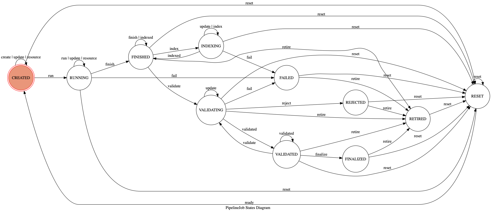

.. _pipelinejobs-manpage:

============
PipelineJobs
============

Essential details of a computation workflow are represented in a **Pipeline**
comprised of static software components and parameterizations. The invocation
of a pipeline, complete with linkages to experimental metadata, inputs, and
run-time parameterization is represented in a **PipelineJob**.

Creation, management, and metadata resolution of Pipelines and PipelineJobs
is implemented in the ``python-datacatalog`` library (this codebase) which is
operated by interlinked Abaco Reactors collectively known as the **PipelineJobs
System**. These Reactors write and mantain records and linkages in the MongoDB
databases that form the Data Catalog. They are documented in :doc:`sharedreactors`

Overview
--------

Each **PipelineJob** is an entry in the Data Catalog **jobs** collection
representing **one and only one** combination of:

* Specific pipeline
* One or more inputs and references
* Run-time parameterizations
* Metadata linkages

This design ensures that any given combination of these values
will **always** be associated with a distinct set of output files (i.e.
sequence alignments, CSVs, data frames, PDF reports, etc.). This design permits
a strong guarantee that those results can always be specifically accessed
and referred to in the future, whether by human-led or automated processes.

Job Lifecycle
#############

A PipelineJob has a formal lifecycle of *states* it can transition between that
represent key stages of an analytics lifecycle. Transitions occur via receipt
of *events*, as illustrated here:.

These states and events are described in detail in the tables below in
approximately chronological order.

States
^^^^^^
{{ pipelinejob_states }}

Events
^^^^^^
{{ pipelinejob_events }}

Job Schema
##########

A PipelineJob has four _core_ properties:

* ``data`` The run-time parameterization of the pipeline
* ``history`` Chronological history of state-change **event**
* ``state`` Current **state** of the job
* ``uuid`` UUID5 hashed from the ``pipeline_uuid`` and job ``data``

It also has four relationship linkages to other assets in the
Data Catalog. These are maintained by the **PipelineJobs System**.

* ``generated_by`` Always the UUID of a **Pipeline** that did the work
* ``child_of`` UUIDs of measurements analysed by the job.
* ``acts_on`` Members of the **file** collection processed by the job
* ``acts_using`` Members of the **references** collection used by the job

There are additional properties in a PipelineJob that are discoverable by
inspecting its schema, which is accessible online:

- Object Schema
   - `URI <{{ project_schema_base_url }}/pipelinejob.json>`_
- Document Schema
   - `URI <{{ project_schema_base_url }}/pipelinejob_document.json>`_
   - `Browser <{{project_schema_browser_url}}/pipeline_job.html>`_

Pipelines
#########

**PipelineJobs** are always linked via ``generated_by`` to :doc:`pipelines-manpage`.
